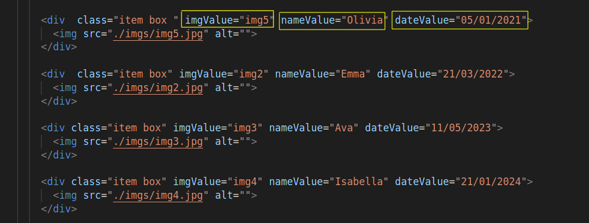

# Gallery_imgs
 Gallery with HTML , CSS Grid and Javascript\
 If you clicked on the small pictures , the main box will show the picture that you clicked \
 in addition will show its name of that picture and its date
 
 # How Can I change the name and the date of a picture ?
 Simply , First on HTML File you can search on **nameValue** if you would change the name of your picture\
 and **dateValue** refer to the date of your picture\
 **Important**\
 the attribute **imgValue** refer to the name of the picture without ***its extension***
  
